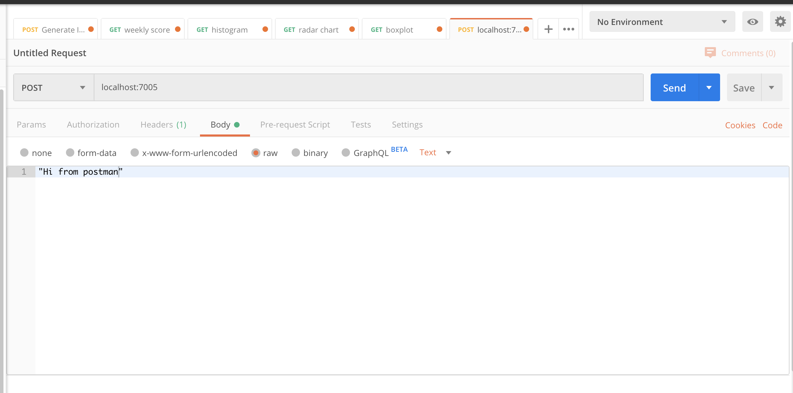

# Network-Listener
Network listener can listen to incoming messages on the provided port (currently, 7005)

# Run
1) `cd` into the root directory after cloning it.   
2) Run it `./main.py`  

# Example  
Send a request to the IPv4 address of the machine on which it is running and port 7005.   

